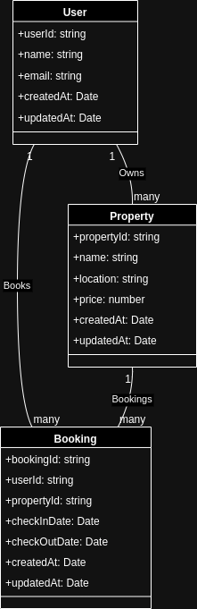

# **Entity-Relationship (ER) Diagram for Property Booking System**

## **Overview**
This project models a **Property Booking System** using an Entity-Relationship (ER) diagram. The system involves three key entities: `User`, `Property`, and `Booking`. The relationships between these entities define how users own properties and make bookings for specific properties. The system is designed for scalability and clarity, making it easy to integrate with a database like MongoDB.

---

## **Entities and Their Attributes**
Below is a description of each entity and its attributes:

### 1. **User**
- Represents the users of the system, who can own properties and make bookings.
- **Attributes**:
  - `userId` (string): Unique identifier for the user.
  - `name` (string): Name of the user.
  - `email` (string): Email address of the user.
  - `createdAt` (Date): Timestamp when the user was created.
  - `updatedAt` (Date): Timestamp of the last update to the user record.

---

### 2. **Property**
- Represents properties listed in the system. Each property is owned by a user.
- **Attributes**:
  - `propertyId` (string): Unique identifier for the property.
  - `name` (string): Name or title of the property.
  - `location` (string): Location of the property.
  - `price` (number): Price per stay (e.g., per night).
  - `createdAt` (Date): Timestamp when the property was created.
  - `updatedAt` (Date): Timestamp of the last update to the property record.

---

### 3. **Booking**
- Represents bookings made by users for specific properties.
- **Attributes**:
  - `bookingId` (string): Unique identifier for the booking.
  - `userId` (string): ID of the user who made the booking.
  - `propertyId` (string): ID of the property being booked.
  - `checkInDate` (Date): Start date of the booking.
  - `checkOutDate` (Date): End date of the booking.
  - `createdAt` (Date): Timestamp when the booking was created.
  - `updatedAt` (Date): Timestamp of the last update to the booking record.

---

## **Relationships**
### 1. **User Owns Property**:
- A user can own multiple properties.
- A property belongs to one user.
- **Cardinality**: 1 User → Many Properties

### 2. **User Books Property**:
- A user can book multiple properties.
- Each booking is associated with a specific user and property.
- **Cardinality**: Many Users ↔ Many Bookings

### 3. **Property Has Bookings**:
- A property can have multiple bookings.
- Each booking is tied to one property.
- **Cardinality**: 1 Property → Many Bookings

---

## **ER Diagram**
Below is the ER diagram representing the relationships between the entities:



---

## **Database Implementation**
This ER diagram can be used as the foundation for designing the database schema. In a MongoDB implementation, the schema could look like this:

### **User Collection**
```json
{
  "_id": "userId",
  "name": "User Name",
  "email": "user@example.com",
  "createdAt": "2024-01-01T00:00:00Z",
  "updatedAt": "2024-01-01T00:00:00Z"
}
